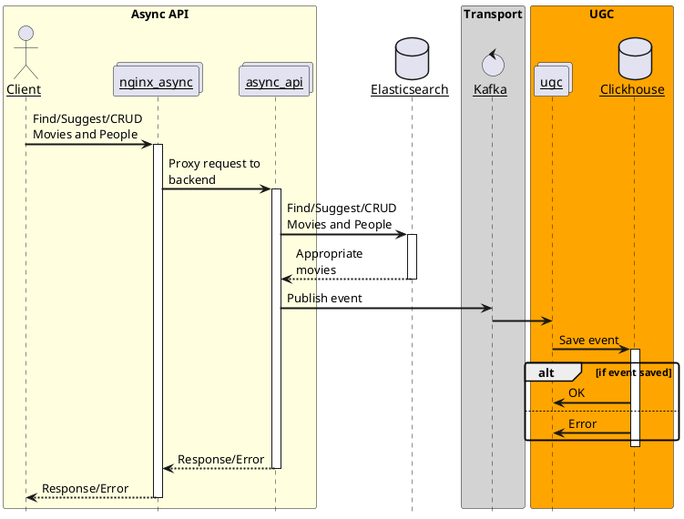

```plantuml
@startuml
skinparam componentStyle uml2
skinparam sequenceArrowThickness 2
skinparam roundcorner 5
skinparam maxmessagesize 120
skinparam sequenceParticipant underline
hide footbox
skinparam BoxPadding 2

box "Async API" #LightYellow
    actor Client
    collections nginx_async
    collections async_api
end box

database Elasticsearch

box "Transport" #LightGray
    control Kafka
end box

box "UGC" #Orange
    collections ugc
    database Clickhouse
end box

Client -> nginx_async: Find/Suggest/CRUD Movies and People
activate nginx_async
nginx_async -> async_api: Proxy request to backend
activate async_api

async_api -> Elasticsearch: Find/Suggest/CRUD Movies and People
activate Elasticsearch
Elasticsearch --> async_api: Appropriate movies
deactivate Elasticsearch

async_api -> Kafka: Publish event
Kafka -> ugc

ugc -> Clickhouse: Save event
activate Clickhouse

alt if event saved
    Clickhouse -> ugc: OK
else
    Clickhouse -> ugc: Error
end
deactivate Clickhouse

async_api --> nginx_async: Response/Error
deactivate async_api

nginx_async --> Client: Response/Error
deactivate nginx_async
@enduml
```